<div align="center">
  
</div>

```bash
+-----------------------------------------------------------------------+
|  // current_focus                                                     |
+-----------------------------------------------------------------------+
|                                                                       |
|  > Scaling backend microservices with Go                              |
|  > Deep diving into Event-Driven Architectures                        |
|                                                                       |
+-----------------------------------------------------------------------+
```

```bash
+-----------------------------------------------------------------------+
|  // tech_stack                                                        |
+-----------------------------------------------------------------------+
|                                                                       |
|  LANGUAGES :: [ Go, C, Python, TS, JS, Bash ]                         |
|  DATABASE  :: [ Postgres, MySQL, MongoDB, Redis, Firebase ]           |
|  INFRA     :: [ AWS, Docker, Nginx, GitHub Actions ]                  |
|  TOOLS     :: [ Git, Linux, Prometheus, Grafana ]                     |
|                                                                       |
+-----------------------------------------------------------------------+
```

<p align="center">
  <code>[ EOF ]</code>
</p>
